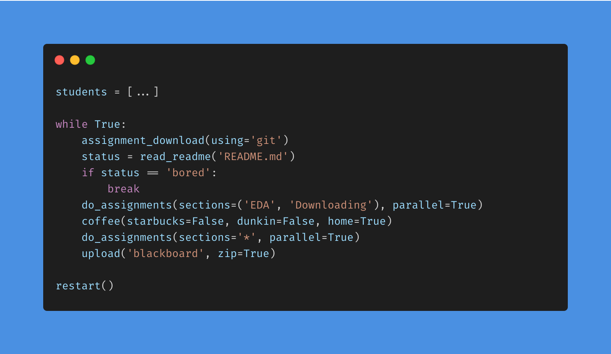
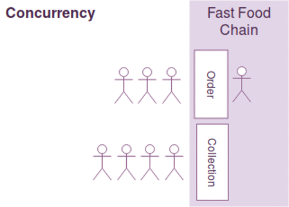
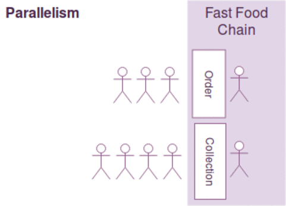

# Assignment 2 - Parallel Programming with Python

Welcome!

In this assignment, we will learn how to do parallel programing using python! 

Below, you will find a section that broadly covers things we did in the class, that may or may not relevant with the assignment. However, This [introductory knowledge section](#introductory-knowledge-on-concepts) can be very much benefical for you while doing this assignment! Hence, **reading** it is a few times is crucial for you!

The goal of this assignment is to teach you the difference between serial and parallel programming, and to get your familar with concepts such as *threading*, *multiprocessing*, etc. Enjoy!

## Introductory Knowledge on Concepts

In order to do the parallel programming in the right way, we need to understand the type of problem we are dealing with first, to be able to find the right way to parallelize the task. Therefore, our first starting point is to understand the two different types of operations.

### IO Bound

[IO bound](https://en.wikipedia.org/wiki/I/O_bound) is when the ability to complete a task/ process is limited by the Input/ Output subsystem of the computer. This type may include the file system, networking, etc. IO bound therefore means, computer takes more time to request the data than to process it.

- Downloading a file from internet.
- Accessing a file/ folder from the computer.
- Accessing a resource in the network.
- Retreiving records from a database.

IO bound considered to be an inherent problem since the begining of the time with computers :smirk:, but no worries, we are here to understand it to live with it.

### CPU Bound

[CPU bound](https://en.wikipedia.org/wiki/CPU-bound) is a process or a task that is limited by the speed of the CPU in a computer.

For example, below is a list of examples for CPU bound.

- Training a machine learning model.
- Multiplying numbers, matrices.
- Preprocessing a dataset, such as transforming columns.
- Doing EDA on a dataset.

### Concurrency vs Parallelism

Concurrency is running two tasks together. When a computer is able to run two tasks at the same time, or it looks as if it started together, we think tasks are running concurrent. While achieving concurrency, a computer may take advantage of [CPU time sharing](https://en.wikipedia.org/wiki/Time-sharing) feature of the operating system, where tasks wait each other and when one runs on the CPU and other on the queue.

Parallelism is can be done on a task or a group of task together. It takes advantage of physical CPU cores of the infrastructure that the computer has, and assigns part of the task or seperate tasks to different CPUs.

In [oracle docs](), concurrency is `a condition that exists when at least two threads are making progress. A more generalized form of parallelism that can include time-slicing as a form of virtual parallelism`. And, paralellism is 	
`a condition that arises when at least two threads are executing simultaneously`.

Concurrency                 | Parallelism
:-------------------------: | :-------------------------:
 |  

For more information on concurrency vs parallelism with python, check out this article on [Hackernoon](https://hackernoon.com/concurrent-programming-in-python-is-not-what-you-think-it-is-b6439c3f3e6a) written by [@melvinkcx](https://github.com/melvinkcx).

### Threading and Multiprocessing

To understand the difference of threading and multiprocessing, lets first have a look at what a thread and a process means.

A thread is the execution of instructions in a given program. It is a subset of a process. It is considered as "lightweight process", since it shares the resources alloted for a process.

A process is a program in execution by the computer. It holds a memory space, a disk space that is unique to the process itself. In a multiprocessing environment, multiple processes of the same task is executed in parallel. For example, creating multiple instance of an application, say, Calculator. Each instance of a calculator is a process.

The **main difference** between the two is that threads share the same memory space, and processes not.

Multithreading takes advantage of having multiple threads in a program. The advantage is the task in hand will be completed much faster if it is IO bound, where the CPU will process more parts of the instructions while all other threads are waiting for a network related delay.

In multiprocessing, IO bound tasks won't be enough since the CPU has to wait for the data to be retreived from the network. However, it the data is already awailable, such as in CPU bound tasks, multiprocessing will be much much faster the total CPU power assigned to the task is much more.

### Packages in Python for Parallel Programming

There are many options to do parallel programming using python. You are more than welcome to choose any of those libraries including the standard packages. My advise is to test diffrent ones, so that you will cover more.

Some of these packages are, but not limited to:

- [Ray](https://github.com/ray-project/ray)
- [Numba](http://numba.pydata.org/)
- [Modin](https://github.com/modin-project/modin)
- [Dask](https://dask.org/)
- [multiprocessing](https://docs.python.org/3.8/library/multiprocessing.html)
- [threading](https://docs.python.org/3.8/library/threading.html)
- [concurrent.futures](https://docs.python.org/3.8/library/concurrent.futures.html)

### Creating a Developer Account 

[Upsplash](https://unsplash.com/) is a website that shares freely awailable usable images. It is a nice website with all cool images from a lot of photographers. 

We will use this website to build our dataset, using their [API](https://en.wikipedia.org/wiki/Application_programming_interface). Follow below how I created my developer account.

## Tasks

In this assignment, you are required to use parallel programming to do the two tasks already done in serial programming.

1. Download images from internet
2. Resize the images you download to thumbnails.

As you will see, when you run the notebook, these tasks are already done using serial programming logic. However, you will see that, the execution of these tasks takes quite a lot of time. 

Your mission, should you choose to accept it, to reduce these timings! 

Following are your list of tasks.

### Setup

- [ ] I created a developer account at [Unsplash Developers](https://unsplash.com/developers).
- [ ] I run the notebook, after running the `Setup the Project` section, it created my `config.ini` file.
- [ ] My images are downloaded to `data/images` folder after running the notebook.
- [ ] I added the `access_key` I got from [Unsplash Developers](https://unsplash.com/developers) website to my `config.ini` file.

### Exploratory Data Analysis Tasks:

- [ ] Print a sample from the dataset.
- [ ] Create a histogram with at least 20 bins from `downloads` field. 
- [ ] Describe the `likes` field. Do an outlier analysis on using [5 number summary](https://en.wikipedia.org/wiki/Five-number_summary).
- [ ] Find the average size of image ratio of the whole dataset using `width` and `height`.
- [ ] Find the unique number of `colors` of the dataset.
- [ ] Replace all the `None` fields in the `description` field with `Not provided` text.
- [ ] Expand `url` field into multiple columns.
- [ ] You are welcome to do more EDA on this dataset.

### Downloading Images Tasks:

- [ ] I've run the existing code with the serial way and collected the timing information.
- [ ] I have at least 1500 images with the min qualiy of `regular`.
- [ ] Implemented downloading images with parallel programming logic.
- [ ] Reduce the amount taken in serial way with parallel programming. (Your timing will definitely be reduced!)

### Resizing Images Tasks:

- [ ] I've run the existing code with the serial way and collected the timing information.
- [ ] Implemented resizing with parallel programming logic.
- [ ] Reduce the amount taken in serial way with parallel programming. (Your timing will definitely be reduced!)

### Conclusion:

- [ ] I collect the timing results of all tasks, put them in a table.
- [ ] I show differences of serial and parallel way of doing the above operations.
- [ ] I understand the difference between `IO bound` and `CPU bound`.
- [ ] I **wrote** a big conclusion that explains all the things that I've done, all supportive graphics, etc.

## What are All These Files?

Following table is will give it a meaning for each file.

File                | Description 
-------             | ----------- 
README.md           | A descriptive file to give an introduction of current project/ assignment. Includes a todo list that **you have to edit**.
LICENCE             | The licence of the file that every project should have.
.gitignore          | The file to control which files should be ignored by Git.
.gitkeep            | An empty file to keep folders under git.
requirements.txt    | A list of python packages you may need for the assignment.
Assignment2.ipynb   | Sample notebook as a reference for how your notebooks should be organized.
images.py           | Helper functions to do HW related tasks, all serial way.
utils.py            | Helper functions to create config file, progress bar, etc.
config.ini          | [Configuration file](https://en.wikipedia.org/wiki/INI_file) to connect Unsplash API.
assets              | A set of images used in this README file. 
data / images       | Folder to download images
data / json         | Folder to download data files from Unsplash API.

## Your To-Do List for This Assignment

- [ ] I **have completed** all the tasks in [tasks](#tasks) section.
- [ ] I edit this README file and checkmarked things I've completed in the tasks section.
- [ ] My notebook(s) are well organized with headings, comments, that makes it visually appealing.
- [ ] My notebook(s) have the results of my execution.
- [ ] My notebook(s) are reproducible.
- [ ] I download the final version of my repository, and uploaded to the [blackboard](https://saintpeters.blackboard.com/)!
